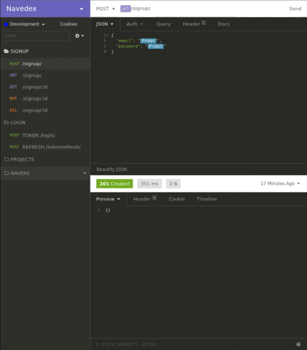
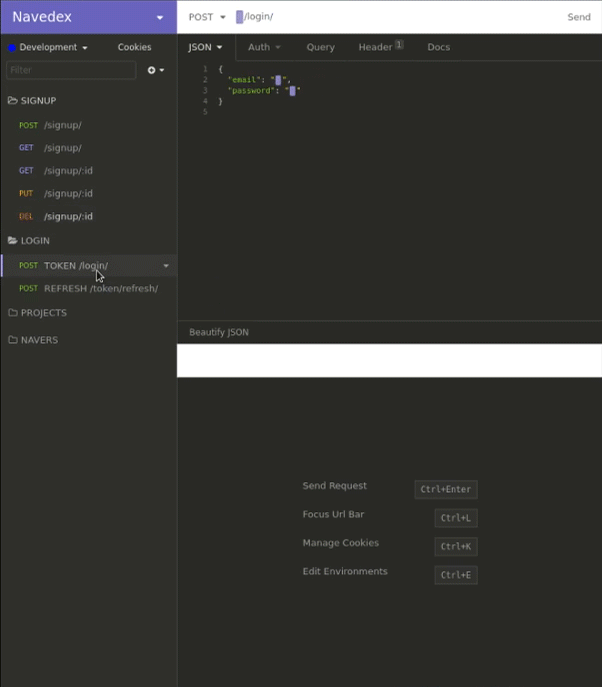
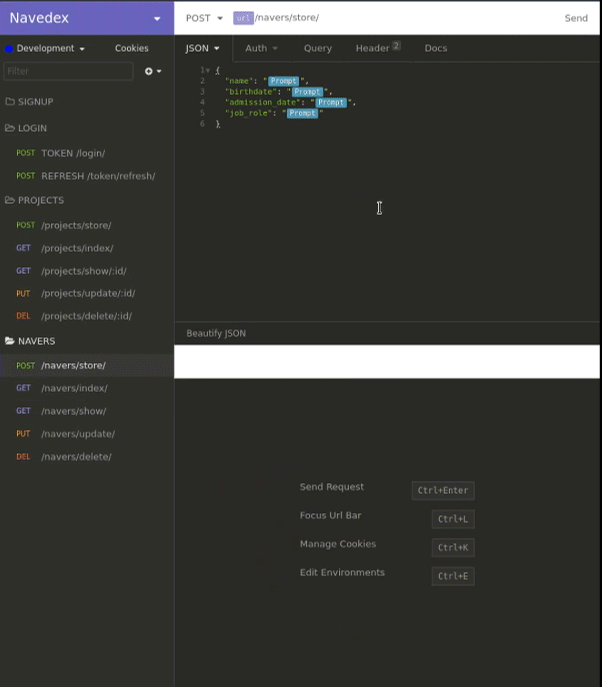
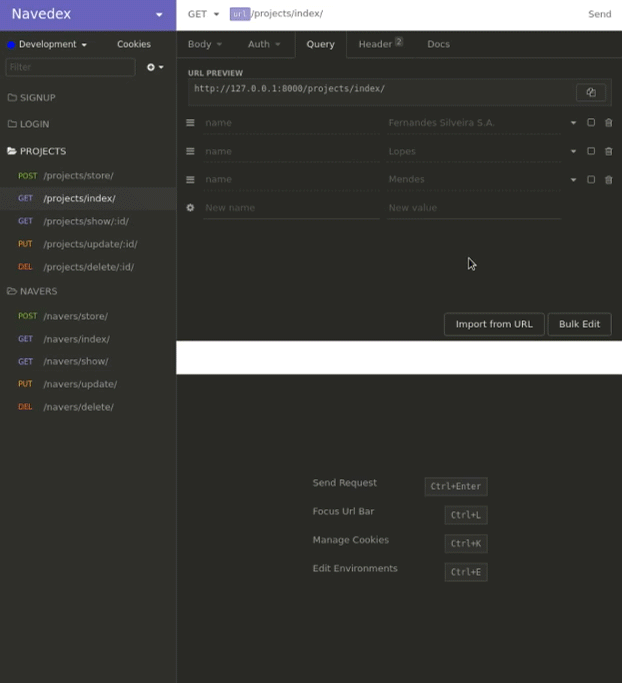

<h1 align="center">
  <a href="https://github.com/WesGtoX/navedex-api">
    
  </a>
  <br />
  
</h1>

<p align="center">
  <a href="#about-the-project">About</a>&nbsp;&nbsp;|&nbsp;&nbsp;
  <a href="#technology">Technology</a>&nbsp;&nbsp;|&nbsp;&nbsp;
  <a href="#getting-started">Getting Started</a>&nbsp;&nbsp;|&nbsp;&nbsp;
  <a href="#usage">Usage</a>&nbsp;&nbsp;|&nbsp;&nbsp;
  <a href="#license">License</a>
</p>

<p align="center">
  
  
  
  
  
</p>


# Navedex API

...


## About the Project

Navedex is an API to register navedex’s and projects in which they participated.

The project was developed using the Django REST Framework which is Django's toolkit, powerful and flexible to build API’s Web.


## Technology 

This project was developed with the following technologies:

- [Python](https://www.python.org/)
- [Django Framework](https://www.djangoproject.com/)
- [Django REST Framework](https://www.django-rest-framework.org/)


## Getting Started

### Prerequisites

- [Python](https://www.python.org/)


### Install and Run

1. Clone the repository:
```bash
git clone https://github.com/WesGtoX/navedex-api.git
```
2. Create and activate a virtual enviroment:
```bash
python -m venv venv
source venv/bin/activate
```
3. Install the dependencies:
```bash
pip install -r requirements-dev.txt
```
4. Run migrations:
```bash
python manage.py makemigrations
python manage.py migrate
```
5. Create a superuser:
```bash
python manage.py createsuperuser
```
6. Run:
```bash
python manage.py runserver
```
7. To run tests:
```bash
pytest
# or
python manage.py test
```


## Usage

### Insomnia

[](https://insomnia.rest/run/?label=Navedex&uri=https%3A%2F%2Fraw.githubusercontent.com%2FWesGtoX%2Fnavedex-api%2Fmaster%2Fnavedex_insomnia.json)

<p align="center">
  
  
</p>

<p align="center">
  
  
</p>


_For more examples, please refer to the [Documentation](https://github.com/WesGtoX/navedex-api/wiki)_


## License

Distributed under the MIT License. See [LICENSE](LICENSE.md) for more information.

---

Made with ♥ by [Wesley Mendes](https://wesleymendes.com.br/) :wave:
